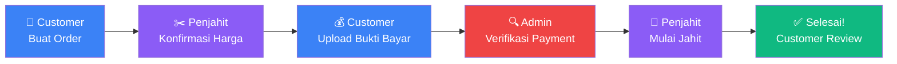

<div align="center">

<!-- Animated header using capsule-render -->


<br/>

<!-- Badges -->
[](https://laravel.com)
[](https://php.net)
[](https://tailwindcss.com)
[](https://sqlite.org)
[](https://vitejs.dev)

<br/>

[](LICENSE)
[](https://github.com/AsriD7/tailortrack/tree/senior)
[](https://github.com/AsriD7/tailortrack/pulls)

</div>

---

<div align="center">

## 🌟 Apa itu TailorTrack?

</div>

**TailorTrack** adalah platform marketplace yang menghubungkan **pelanggan** dengan **penjahit berbakat** di seluruh Indonesia. Pesan baju custom impianmu, pantau proses jahit secara real-time, dan bayar dengan mudah — semuanya dalam satu platform! 🎉

```
🔍 Cari Penjahit  →  📋 Buat Order  →  💰 Bayar  →  ✅ Terima Jahitan!
```

---

## ✨ Fitur Unggulan

<table>
  <tr>
    <td align="center" width="33%">
      <h3>👗 Order Custom</h3>
      Buat pesanan dengan detail ukuran, deskripsi, dan foto referensi. Penjahit konfirmasi harga sesuai kebutuhanmu.
    </td>
    <td align="center" width="33%">
      <h3>📊 Tracking Real-time</h3>
      Pantau status pesananmu dari <em>Menunggu Konfirmasi</em> hingga <em>Selesai</em> dengan riwayat lengkap.
    </td>
    <td align="center" width="33%">
      <h3>💳 Sistem Pembayaran</h3>
      Upload bukti pembayaran dan tunggu verifikasi admin. Aman dan transparan!
    </td>
  </tr>
  <tr>
    <td align="center" width="33%">
      <h3>🏪 Profil Penjahit</h3>
      Lihat portofolio, spesialisasi, rating, dan pengalaman penjahit sebelum memesan.
    </td>
    <td align="center" width="33%">
      <h3>⭐ Review & Rating</h3>
      Berikan ulasan setelah pesanan selesai. Bantu pelanggan lain memilih penjahit terbaik!
    </td>
    <td align="center" width="33%">
      <h3>🔐 Multi-Role System</h3>
      Tiga peran berbeda: Customer, Penjahit, dan Admin — masing-masing dengan dashboard sendiri.
    </td>
  </tr>
</table>

---

## 🗺️ Alur Order



---

## 👥 Peran Pengguna

<details>
<summary><b>🙋 Customer (Pelanggan)</b> — klik untuk lihat detail</summary>
<br/>

| Fitur | Deskripsi |
|-------|-----------|
| 🔍 Cari Penjahit | Lihat daftar penjahit, profil, portofolio, dan rating |
| 📋 Buat Order | Pesan custom dengan foto referensi & pilihan ukuran |
| 💰 Bayar | Upload bukti pembayaran dengan mudah |
| 📦 Tracking | Pantau status pesanan secara real-time |
| ❌ Cancel Order | Batalkan pesanan saat masih menunggu konfirmasi |
| ⭐ Review | Berikan rating & ulasan setelah pesanan selesai |

</details>

<details>
<summary><b>✂️ Penjahit (Tailor)</b> — klik untuk lihat detail</summary>
<br/>

| Fitur | Deskripsi |
|-------|-----------|
| 🏪 Kelola Toko | Edit profil, spesialisasi, dan bio toko |
| 🖼️ Portofolio | Showcase hasil karya terbaikmu |
| 📬 Kelola Order | Terima, konfirmasi harga, dan update status |
| 📊 Dashboard | Lihat statistik order dan pendapatan |

</details>

<details>
<summary><b>🔑 Admin</b> — klik untuk lihat detail</summary>
<br/>

| Fitur | Deskripsi |
|-------|-----------|
| ✅ Verifikasi Penjahit | Setujui penjahit baru yang mendaftar |
| 💳 Verifikasi Payment | Konfirmasi atau tolak bukti pembayaran |
| 📋 Kelola Daftar Harga | Atur harga global untuk semua layanan |
| 👥 Kelola Pengguna | Pantau dan kelola semua akun customer |
| 📊 Laporan | Lihat semua order dan pembayaran di platform |

</details>

---

## 🛠️ Tech Stack

<div align="center">

| Layer | Teknologi |
|-------|-----------|
| **Backend** |   |
| **Frontend** |   |
| **Build Tool** |  |
| **Database** |  |
| **Testing** |  |

</div>

---

## 🚀 Cara Menjalankan

### Prasyarat

Pastikan sudah terinstall:
- **PHP** >= 8.3
- **Composer**
- **Node.js** >= 18 & npm

### Instalasi

```bash
# 1. Clone repository
git clone -b senior https://github.com/AsriD7/tailortrack.git
cd tailortrack

# 2. Install dependencies PHP
composer install

# 3. Salin file environment
cp .env.example .env

# 4. Generate application key
php artisan key:generate

# 5. Jalankan migrasi database
php artisan migrate

# 6. Install dependencies JavaScript
npm install

# 7. Build assets
npm run build
```

### Jalankan Development Server

```bash
# Jalankan semua sekaligus (server + queue + logs + vite)
composer run dev
```

Buka browser dan akses: **http://localhost:8000** 🎉

### Seed Data (Opsional)

```bash
# Isi database dengan data contoh
php artisan db:seed
```

---

## 📁 Struktur Direktori

```
tailortrack/
├── 📂 app/
│   ├── 📂 Enums/              # OrderStatus, PaymentStatus, UserRole
│   ├── 📂 Http/
│   │   └── 📂 Controllers/
│   │       ├── 📂 Admin/      # Controller admin panel
│   │       ├── 📂 Auth/       # Login & Register
│   │       ├── 📂 Customer/   # Dashboard customer
│   │       ├── 📂 Public/     # Halaman publik
│   │       └── 📂 Tailor/     # Dashboard penjahit
│   └── 📂 Models/             # Eloquent Models
├── 📂 database/
│   ├── 📂 migrations/         # Skema database
│   ├── 📂 factories/          # Factory untuk testing
│   └── 📂 seeders/            # Data awal
├── 📂 resources/views/        # Blade templates
│   ├── 📂 admin/
│   ├── 📂 customer/
│   ├── 📂 tailor/
│   └── 📂 public/
└── 📂 routes/
    └── 📄 web.php             # Semua routing
```

---

## 🗃️ Database Schema

```
users ──────────────┬── tailor_profiles
   │                │
   ├── customer ────┤── orders ──── order_images
   │                │      │
   └── tailor ──────┘      ├── payments
                           ├── tracking_histories
                           └── reviews

price_lists ─── orders
portfolios  ─── tailor_profiles
```

---

## 🧪 Menjalankan Test

```bash
composer test
```

---

## 🗺️ Roadmap

- [x] ✅ Manajemen order & tracking
- [x] ✅ Upload bukti pembayaran
- [x] ✅ Sistem rating & review
- [x] ✅ Portofolio penjahit
- [ ] 🔔 Notifikasi email/push
- [ ] 💳 Integrasi Midtrans / payment gateway
- [ ] ☁️ Migrasi storage ke S3
- [ ] 📱 REST API untuk mobile app
- [ ] 🔐 Verifikasi email saat register

---

## 🤝 Kontribusi

Kontribusi sangat diterima! Berikut caranya:

1. **Fork** repository ini
2. Buat branch fitur baru: `git checkout -b fitur/nama-fitur`
3. Commit perubahanmu: `git commit -m 'Tambah fitur keren'`
4. Push ke branch: `git push origin fitur/nama-fitur`
5. Buat **Pull Request** 🚀

---

## 📜 Lisensi

Didistribusikan di bawah lisensi **MIT**. Lihat [`LICENSE`](LICENSE) untuk informasi lebih lanjut.

---

<div align="center">

Dibuat dengan ❤️ oleh [AsriD7](https://github.com/AsriD7)


</div>
